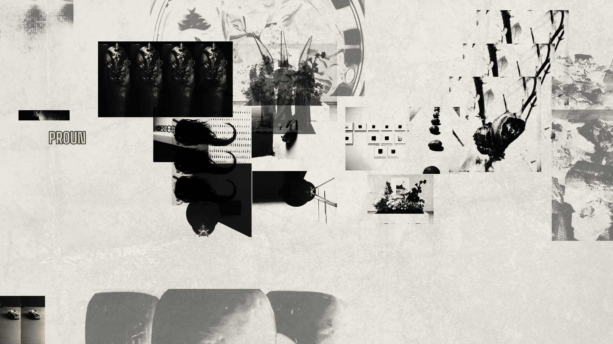

```ascii
██████╗ ██████╗  ██████╗ ██╗   ██╗███╗   ██╗
██╔══██╗██╔══██╗██╔═══██╗██║   ██║████╗  ██║
██████╔╝██████╔╝██║   ██║██║   ██║██╔██╗ ██║
██╔═══╝ ██╔══██╗██║   ██║██║   ██║██║╚██╗██║
██║     ██║  ██║╚██████╔╝╚██████╔╝██║ ╚████║
╚═╝     ╚═╝  ╚═╝ ╚═════╝  ╚═════╝ ╚═╝  ╚═══╝

       by Hex (@RemiH06)          version 1.0
```


### General Description

En 1919, exiliado de la pintura por decreto propio, El Lissitzky empezó a llamar
Proun a unos objetos que no eran ni cuadros ni edificios: *Projects for the
Affirmation of the New*, decía la sigla rusa, aunque él prefería explicarlo
como "la estación de trasbordo entre la pintura y la arquitectura". Un Proun no
representaba nada; era una estructura que existía en varios planos a la vez,
girando sobre un eje que el espectador tenía que completar caminando alrededor
del cuadro. Klutsis, Ródchenko y Kulagina llevaron el mismo principio al
fotomontaje: fragmentos fotográficos ajenos, aplanados a una sola tinta,
obligados a compartir una superficie que ninguno de ellos pedía compartir.

Esta herramienta hace ese trasbordo con el archivo personal de quien la usa.
Toma imágenes de orígenes irreconciliables (una radiografía de museo, una foto
de años escolares, un cianotipo de 1843, una foto del refrigerador) y las obliga a
existir en la misma tinta. El resultado pretende ser lo
que un Proun: un plano de tránsito y no necesariamente arte.

```diff
- Warnings
```

La normalización de paleta es agresiva por diseño: espera que se lo digas si
el resultado te parece demasiado uniforme. `PENDIENTES.md` documenta cada
límite conocido en vez de esconderlo.

## Installation

1. Instala Pillow, la única dependencia:

   `pip install -r requirements.txt`

2. Pon tus imágenes en `fuentes/` (o donde prefieras; se declara en la
   configuración).

3. Corre la herramienta:

   `python main.py`

   Editando `CONFIG` dentro de `main.py`, o por línea de comandos:

   `python main.py --images fuentes/ --resolutions 1920x1080 --spectrum 6 --count 4`

No hay paso 4. No hay ChromeDriver, no hay cuentas, no hay proxies. Es una
herramienta de escritorio que lee imágenes y escribe imágenes.

## Launch arguments

- `--images RUTA...` archivos, directorios o globs con las fuentes
- `--spec ARCHIVO` especificación completa en JSON
- `--resolutions WxH...` una carpeta de salida por resolución
- `--colors HEX...` / `--spectrum N` paleta explícita o generada
- `--count N` / `--seed N` / `--seeds N...` cuántas composiciones y con qué semilla
- `--layers N|MIN-MAX` cuántas capas entran a cada collage
- `--layout MODO` scatter, free, grid, row, column, stack, align
- `--mode MODO` / `--strength N` modo de recoloreado y su fuerza
- `--background COLOR` / `--no-tones` fondo y normalización tonal
- `--format png|jpg|webp` / `--quality N` / `--optimize`
- `--clean` borra los wallpapers generados (acepta los mismos filtros)
- `--overwrite` / `--dry-run` / `--quiet`

Todas documentadas con `python main.py --help`.

## Screenshots

<p>
  
  
</p>
<p>
  
  
</p>

Documentación con más ejemplos en [remih06.github.io/Proun](https://remih06.github.io/Proun/).

## Features

- Normalización de paleta: cualquier color puede volverse transparente, y de
  ahí sale la polaridad de tinta sobre papel o de luz sobre oscuridad
- Mosaico y repetición por proporciones, con espejado y giro acumulado
- Figuras geométricas generadas (rect, circle, triangle, diamond, polygon) con
  contorno hacia adentro del borde real
- Texto generado con fuente empaquetada, sin depender del sistema operativo
- Manchas de humedad y desgaste, por capa o sobre el fondo
- Composición alineada tipo estantería, con `layout.mode = "align"`
- Reproducible: el nombre de cada archivo trae la semilla que lo regenera
- Sin dependencias más allá de Pillow

## Future Features

Nada decidido todavía. `PENDIENTES.md` es el lugar donde algo se vuelve
"decidido".